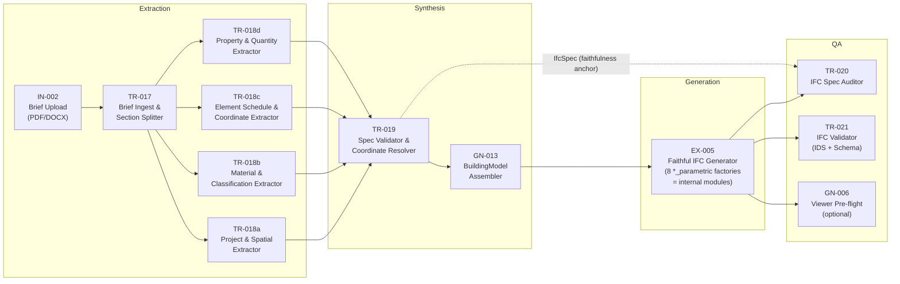

# Brief-to-IFC v2 — Analysis & Proposal

**Mode:** Read-only forensic analysis. Zero production code written.
**Date:** 2026-05-14
**Branch:** `feat/brief-to-ifc-v2-analysis` (created from `origin/main`, working tree only, zero commits)
**Deliverable:** this file.
**Method:** every file in §3 of the prompt read end-to-end (directly or via three parallel sub-agents covering the Python service, the async-job primitives, and the canvas execution flow). Every forensic claim cites `file:line` or `file:function`. Where a fact cannot be known from source alone it is marked `unknown — investigate in Phase 1`.

---

## 0. TL;DR (5 bullets)

1. **The §0 root-cause hypothesis is mechanically wrong but directionally right.** TR-001 is *not* a mock — it really parses the brief (multi-layer PDF/DOCX text extraction + GPT-4o-mini structuring + a deterministic floor-plan regex parser). It never touches IfcOpenShell. The brief *is* read. What is "decorative" is the brief's **structured content**, and the reason is three layers deep, not one.
2. **The real bottleneck is a lossy contract, not a fake node.** TR-001's only output channel for structured data is `ParsedBrief` (`src/features/ai/services/openai.ts:2727-2753`) — a generic ~10-field design-brief shape with **no slot for an element schedule, a coordinate table, a material catalog, Psets, quantities, or classifications**. A 2,284-line surgical spec is GPT-4o-mini–compressed (input also truncated to 12,000 chars at `openai.ts:2780`) into a handful of `programme[]` rows + free text. The spec's structured content dies at TR-001's output boundary.
3. **EX-001 never builds elements from a spec — all three of its generation paths are procedural-inference or template-instantiation.** It regex-extracts ~5 scalars (`floors` defaults to **5** at `ex-001.ts:200-203` and `massing-generator.ts:1557`), or routes to the Python *design agent* whose entire design space is **9 hard-coded Pune residential templates** (`template_catalog.py:86`), `habitable_floor_count` defaulting to **5** (`tier2_2bhk_pune_tower.py:106`). The "generic 5-storey apartment, 274 elements" is exactly that template's deterministic output for G+5. A 15×15 m Dubai exhibition stand is *refused* by the matcher (`prompts/template_matcher.py:72-97`) or silently mis-mapped.
4. **The codebase already contains the v2 building blocks** — they are just not wired to a faithful path: 8 clean Python `*_parametric` element factories (`wall/slab/column/beam/space/stair/opening/mep_builder.py`), the `BuildingModel` parametric graph with 13 fail-loud invariants (`app/domain/building_model.py`), the placement/geometry resolvers, IDS validation (`ids_validator.py` + 6 `.ids` files), the `/api/v1/audit` entity counter, and the `BriefRenderJob` async-pipeline pattern (the proven "faithful brief → output" template, strict-faithfulness contract, anti-hallucination).
5. **v2 must invert the architecture's core assumption.** Every IFC generator in the repo — `generateMassingGeometry`, the design agent, the *Rich IFC Plan v2* — is built to **fill in what the user didn't say**. A surgical spec needs the opposite: **emit exactly what is stated, invent nothing** (the SOL spec literally ships a §0.3 anti-hallucination contract). The fix is a new *faithful-translation* spine — `Brief → IfcSpec → BuildingModel → IFC → audited-against-IfcSpec` — decomposed into ~10 small canvas nodes, each individually improvable. Element-type "factories" should stay **code modules** (they already are, in Python), not become separate canvas nodes — see §2.1 / §3 Ambiguities for why.

---

# 1. Current Pipeline Forensics

## 1.1 Pipeline Map

### The workflow under audit

The "Brief-to-IFC" workflow on the canvas is **`wf-08` — "PDF Brief → IFC + Video Walkthrough"** (`src/features/workflows/constants/prebuilt-workflows.ts:22-110`). It is the only prebuilt workflow that wires a brief upload into an IFC export. Graph:

```
IN-002 (PDF Upload) ──pdf-out→pdf-in──▶ TR-001 (Brief Parser) ──text-out→geo-in──▶ EX-001 (IFC Exporter)
                                                  └────────────text-out→geo-in────▶ GN-009 (Video Walkthrough)
```

Edges (`prebuilt-workflows.ts:104-108`): `n1→n2` (`pdf-out`→`pdf-in`), `n2→n3` (`text-out`→`geo-in`), `n2→n4` (`text-out`→`geo-in`). Note the **type mismatch tolerated everywhere**: TR-001 emits `text-out` (type `text`) and it is plugged into EX-001's `geo-in` (type `geometry`). Edge port types are cosmetic — there is no type check (see §1.5).

So the §0 description ("exactly THREE nodes: PDF Upload, Brief Parser, IFC Exporter") is accurate for the IFC sub-path; GN-009 is a 4th node fanning off the same TR-001 output.

### Hop 0 — IN-002 (PDF Upload): client-side, no server handler

IN-002 is **not in `REAL_NODE_IDS`** (`src/app/api/execute-node/route.ts:20`) and has **no handler** in the registry (`src/app/api/execute-node/handlers/index.ts:40-64`). Input nodes never call `/api/execute-node`.

- **Where the file lives:** `FileUploadInput` writes the picked `File` into a module-level `Map` `inputFileStore` keyed by node id (`src/features/canvas/components/nodes/InputNode.tsx:19`, populated at `:100-218`), and merges base64/metadata (`fileName`, `fileData`, `mimeType`, `fileSize`) into the React-Flow node `data` via `updateNode`. IN-002's `FileUploadInput` accepts **both `.pdf` and `.docx`** (the catalogue still calls the node "PDF Upload" — `node-catalogue.ts:20`).
- **How it enters execution:** `useExecution.executeNode` short-circuits `INPUT_NODE_IDS` (`src/features/execution/hooks/useExecution.ts:92,110-276`) — after a 150 ms cosmetic delay it base64-encodes the file and returns a **synthetic artifact** `{ type:"text", data:{ fileData:<base64>, fileName, mimeType, fileSize, … }, metadata:{ source:"user-input" } }`. No network call.
- **Side effects:** none server-side. File objects live only in the in-memory `Map` — a page reload loses them even though node `data` may persist via the workflow-store's localStorage `persist`.

### Hop 1 — TR-001 (Brief Parser): real handler

- **File:** `src/app/api/execute-node/handlers/tr-001.ts` (337 lines), registered `index.ts:41`, dispatched from `route.ts:313-336`.
- **Input shape (`inputData`, typed `any`):** consumes `inputData.fileData ?? inputData.buffer` (base64) and `inputData.content ?? inputData.prompt ?? inputData.rawText` (`tr-001.ts:17-21`).
- **What it does:**
  1. Size gate ≤27 MB base64 (`tr-001.ts:24-37`).
  2. **Magic-byte sniff** (`tr-001.ts:79-81`): DOCX (`PK\x03\x04`) → `extractTextFromDocx` (`@/lib/docx-text-extractor`, mammoth). PDF (`%PDF`) → `extractTextFromPdf` (`@/lib/pdf-text-extractor`, a 3-layer chain: unpdf → pdf-parse → Claude vision-document) (`tr-001.ts:114-157`).
  3. Hard gate: extracted text `< 100` chars → HTTP 422 `BRIEF_TOO_SHORT` (`tr-001.ts:167-181`).
  4. `parseBriefDocument(extractedText, apiKey, pdfBuffer)` (`openai.ts:2755`) — **GPT-4o-mini**, `response_format: json_object`, input **truncated to 12,000 chars** (`openai.ts:2780-2782`) → `ParsedBrief`. In parallel, embedded reference images are extracted + uploaded to R2 (`openai.ts:2767-2774`).
  5. Deterministic floor-plan override: `extractFloorPlanFromText` (`src/features/ifc/services/floor-plan-text-parser.ts`) runs *after* GPT; if it detects a floor-plan brief (plot dims + ≥1 dimensioned room) it **overwrites** `parsed.floorPlan` (`tr-001.ts:199-243`).
  6. Plot-dimension hallucination guard (`tr-001.ts:254-289`).
- **Output shape (`ExecutionArtifact`):** `{ type:"text", data:{ content:<formattedText>, label, _raw:<ParsedBrief>, prompt:<formattedText> }, metadata:{ model:"gpt-4o-mini", real:true } }` (`tr-001.ts:322-335`). The load-bearing field for downstream is **`data._raw` (a `ParsedBrief`)** plus `data.content`/`data.prompt` (a flat formatted-text rendering built at `tr-001.ts:299-316`).
- **Side effects:** OpenAI call; Anthropic vision call (only if PDF extractors fail); R2 upload of reference images.

### Hop 2 — EX-001 (IFC Exporter): real handler

- **File:** `src/app/api/execute-node/handlers/ex-001.ts` (682 lines), registered `index.ts:61`.
- **Input shape (`inputData`, typed `any`):** reads `inputData._raw` (the `ParsedBrief`), `inputData._raw.floorPlan` (a `FloorPlanSchema`), `inputData.content`/`inputData.prompt` (text), `inputData.ifcUrl`, `inputData._geometry`, and loose numeric fields (`inputData.floors`, `.footprint`, `.buildingType`, `.gfa`, `.height`).
- **Five generation paths, in order:**
  - **Path 0** (`ex-001.ts:48-67`): if `inputData.ifcUrl` is an http URL → pass it straight through (used when an upstream GN-001 already produced IFC).
  - **Path A.5** (`ex-001.ts:69-154`): if `_raw.floorPlan` is present → `floorPlanToMassingGeometry()` (`src/features/ifc/services/floor-plan-to-massing.ts:1436`) converts the quadrant/ft room schema into a `MassingGeometry`; forces `richMode:"full"`.
  - **Path A** (`ex-001.ts:303-449`): if `process.env.USE_DESIGN_AGENT_PIPELINE === "true"` → `synthesizeBrief()` (passes the upstream brief text **verbatim** when ≥24 chars — `brief-synthesizer.ts:70-71`) → `generateIFCViaDesignAgent()` → Python `POST /api/v1/design/generate`.
  - **Path B/C** (`ex-001.ts:175-273`): regex-extract scalars from the formatted text — `floors` **defaults to 5** (`ex-001.ts:200-203`), footprint defaults to 500, `buildingType` defaults to `"Mixed-Use Building"` (`ex-001.ts:227-231`) — then `generateMassingGeometry()` (`src/features/3d-render/services/massing-generator.ts:1551`, `floors` `?? 5` at `:1557`).
  - **Service call** (`ex-001.ts:451-563`): `isServiceReady()` probe → `generateIFCViaService()` → Python `POST /api/v1/export-ifc` (legacy `MassingGeometry`→IFC path).
  - **TS fallback** (`ex-001.ts:565-605`): `generateMultipleIFCFiles()` from `ifc-exporter.ts` — explicitly **FROZEN / deprecated** (`ifc-exporter.ts:1-35`), four discipline files, gate flags default off.
- **Output shape:** `{ type:"file", data:{ files:[…], totalSize, name, downloadUrl, … }, metadata:{ engine:"ifcopenshell"|"ifc-exporter", ifcServiceUsed, ifcServicePath:"design-agent"|"python"|"ts-fallback", designAgentUsed, designAgentTemplate, richMode, … } }` (`ex-001.ts:609-661`).
- **Side effects:** Python HTTP calls; when the Python parametric path returns a `building_model_json`, EX-001 writes a `BuildingModel` Prisma row + R2 JSON (`ex-001.ts:493-549`).

### Timing — where does ~29.6 s come from?

The exact per-stage breakdown for `executionId cmp5bjhll000104jvg8vizmzl` is **unknown without execution logs / DB access — investigate in Phase 1.** Reasoned estimate from the code paths:

| Stage | Estimate | Source |
|---|---|---|
| IN-002 client encode | ~0.15 s | `useExecution.ts:110-276` |
| TR-001 DOCX/PDF extract + ref-image extract | ~3–6 s | `tr-001.ts:70-158`, parallel image extraction `openai.ts:2767` |
| TR-001 `parseBriefDocument` (GPT-4o-mini, 12 k-char input) | ~4–9 s | `openai.ts:2784` |
| EX-001 design-agent cold (`/api/v1/design/generate`, 5-stage LLM) | ~15–25 s | `ifc-service-client.ts:319-324` ("15–25 s cold") |
| — or — EX-001 legacy `/export-ifc` | up to ~30 s | `ifc-service-client.ts:55` `TIMEOUT_MS=30_000` |
| GN-009 video submit (returns fast, polls async) | ~1–3 s | `useExecution.ts:1901-1994` |

29.6 s ≈ TR-001 (~10 s) + EX-001 design-agent or legacy export (~18 s) + overhead. The execution is **synchronous and blocking** (§1.6) so these add up serially. **Which EX-001 path actually ran for the SOL execution is unknown without logs** — it hinges on whether `USE_DESIGN_AGENT_PIPELINE` is set in production (the flag is **not in `.env.example`** — undocumented).

## 1.2 TR-001 (Brief Parser) Forensics — the smoking gun

**§0's claim:** *"TR-001 is a mock. It does not parse the brief. It triggers a stock template through IfcOpenShell and returns a valid-but-generic IFC."*

**Verdict: REFUTED as written; the spirit is CONFIRMED but the mechanism is in a different place.**

| Question | Evidence | Answer |
|---|---|---|
| Is it actually parsing the uploaded file? | `tr-001.ts:70-158` — magic-byte sniff, DOCX→mammoth, PDF→unpdf/pdf-parse/Claude-vision; `:167-181` hard 422 on `<100` chars | **Yes.** It genuinely extracts text and fails loud on empty input. |
| Is there any LLM call / text-extraction / DOCX read / PDF read? | LLM: `parseBriefDocument` → GPT-4o-mini (`openai.ts:2784-2785`). DOCX: `extractTextFromDocx` (`tr-001.ts:87-88`). PDF: `extractTextFromPdf` (`tr-001.ts:118-124`). | **Yes to all four.** |
| Where does the "5-story apartment" template come from? | **Not from TR-001.** TR-001 emits no template and no IFC. The "5" originates in EX-001 (`ex-001.ts:203` `extractFromText([...], 5)`; `massing-generator.ts:1557` `floors ?? … ?? 5`) and/or the Python tower-template default (`tier2_2bhk_pune_tower.py:106` `habitable_floor_count: int = 5`). | TR-001 is **not** the source. |
| Does it trigger IfcOpenShell? | Zero references to the IFC service in `tr-001.ts`. | **No.** That is EX-001. |
| What field on its output does EX-001 actually consume? | EX-001 reads `inputData._raw` (`ex-001.ts:76,169,179`), `_raw.floorPlan` (`ex-001.ts:77`), `inputData.content`/`prompt` (`ex-001.ts:180`). | `_raw` (a `ParsedBrief`), `_raw.floorPlan`, and the flat `content` text. |
| Does the brief content reach EX-001 in any form? | `_raw` (ParsedBrief) and `content` (formatted text) both reach EX-001's `inputData`. On Path A, `synthesizeBrief` forwards `content` verbatim to the Python design agent (`brief-synthesizer.ts:70-71`). | **Yes — the brief text reaches EX-001 and even the Python LLM.** But see below. |
| Confirm or refute: "TR-001 is decorative." | — | **The node is not decorative. The brief's *structured spec content* is decorative** — and the cause is the contract, not the node (see the three-layer failure below). |

### Why the structured spec is decorative — the three real failures

**Layer 1 — the lossy `ParsedBrief` contract.** TR-001's only structured output is `ParsedBrief` (`openai.ts:2727-2753`):

```ts
interface ParsedBrief {
  projectTitle; projectType; site?; programme?: {space; area_m2?; floor?}[];
  constraints?: {maxHeight?; setbacks?; zoning?}; budget?; sustainability?;
  designIntent?; keyRequirements?: string[]; rawText; referenceImageUrls?;
  floorPlan?: FloorPlanSchema;   // only for quadrant-based residential briefs
}
```

A SOL-class surgical spec (§0–§26: project header, units, site/building/storey, 8 `IfcSpace`s, full material catalog, ~50 elements with explicit coordinates, Psets, quantities, Uniclass classifications, a §24 master coordinate table, a §0.3 anti-hallucination contract) **has no home in this shape.** There is no element-schedule field, no coordinate-table field, no material-catalog field, no Pset/quantity/classification field. GPT-4o-mini — handed at most 12,000 of the 2,284-line spec's characters (`openai.ts:2780-2782`) — compresses everything into a few `programme[]` rows + `keyRequirements[]` + `designIntent` free text. **The structured spec is destroyed at the JSON-schema boundary of `ParsedBrief`.**

**Layer 2 — `floorPlan` is the only "geometry-bearing" channel, and it cannot represent a coordinate spec.** `FloorPlanSchema` (`src/features/ifc/types/floor-plan-schema.ts:124-145`) is **quadrant-based** (`quadrant: "NW"|"N"|…|"center"`), **feet-based**, and **residential-biased** (defaults: `buildingCategory:"residential"`, `storeyHeightFt:12`, residential furniture presets). The SOL spec gives **explicit (x, y) coordinates in a master table**, not "NW quadrant" — so the floor-plan path either does not fire (`extractFloorPlanFromText` needs `plot + ≥1 dimensioned room`, `floor-plan-text-parser.ts:308`) or fires with wrong geometry.

**Layer 3 — the catalogue actively mislabels the node.** `node-catalogue.ts:111-121`: TR-001's `apiEngine` is advertised as `"Azure AI Document Intelligence"` — **false**; it is unpdf/pdf-parse/Claude/GPT-4o-mini. And TR-001 is **absent from `LIVE_NODES`** (`node-catalogue.ts:681`), so `node.isLive = false` (`:684-686`) — the UI renders it as a non-live / "DEMO"-style node *even though it has a real handler and is in `REAL_NODE_IDS`*. This is the "labeled DEMO in the UI" observation in §0: a catalogue-vs-handler inconsistency, not a fake handler.

**Net:** TR-001 reads the brief faithfully, then pours it through a funnel (`ParsedBrief`) too narrow to carry a surgical spec. Everything past that funnel is operating on a generic summary.

## 1.3 EX-001 (IFC Exporter) Forensics

| Question | Evidence | Answer |
|---|---|---|
| Python service or TS fallback or both? | `ex-001.ts:317-605` — tries design-agent (Path A, flagged), then legacy `/export-ifc`, then TS fallback. | **All three, in priority order**, with graceful fall-through on any failure. |
| Which path ran for `cmp5bjhll000104jvg8vizmzl`? | Path A fires only if `USE_DESIGN_AGENT_PIPELINE==="true"` (`ex-001.ts:317`); legacy path fires if `isServiceReady()` probes OK (`ex-001.ts:457-461`); TS fallback if both fail. The selector is env + service liveness. | **Unknown without logs / Vercel env / Railway liveness — investigate in Phase 1.** `metadata.ifcServicePath` on the artifact records it per-run but is not surfaced in any UI (corroborated by `docs/ifc-phase-0-audit.md §7`). |
| If Python: which endpoint, payload, response? | Design-agent: `POST {IFC_SERVICE_URL}/api/v1/design/generate`, body `{brief_text, target_fidelity, build_id}` (`ifc-service-client.ts:397-401`), response `DesignAgentResponse` `{ifc_url, ifc_size_bytes, match_result.template_id, ids_validation, …}` (`:329-363`). Legacy: `POST /api/v1/export-ifc`, body `{geometry:MassingGeometry, options, filePrefix}` (`:225-247`), response `IFCServiceResponse` `{status, files[], metadata}` (`:22-49`). | Two distinct Python endpoints. |
| Python side: template-instantiation, element-factory, or hybrid? | Design agent `/api/v1/design/generate` (`routers/design.py:794`) → 5 LLM stages → `dispatch_template()` (`template_dispatcher.py:85`) → **one of 9 hand-coded Pune template builders** (`app/templates/tier2_*.py`). Legacy `/export-ifc` → `build_multi_discipline()` (`ifc_builder.py:844`) walks the `MassingGeometry` and dispatches per-element to type builders. | **Template-instantiation** on the design-agent path; **element-walk** on the legacy path. Neither is a *spec-driven* factory. |
| Where does "5 storeys, apartment typology" get decided? | `tier2_2bhk_pune_tower.py:106` `habitable_floor_count: int = 5`; the matcher prompt instructs the LLM to leave the count `null` when unspecified (`prompts/template_matcher.py:121-127`); `template_dispatcher.py:132-134` only forwards the kwarg when non-null → **builder default 5 wins.** Typology: the `TemplateMatcher` LLM picks `TemplateId.BHK2_PUNE_TOWER` from the catalog few-shots that map "apartment building" → that template (`prompts/template_matcher.py:183-201`). | Storey count = builder default; typology = a 9-way enum classification. The "274 elements" is the deterministic element count of the 2BHK-tower template at G+5 (the builder docstring tabulates ≈94 walls / 34 rooms / 40 doors / 126 beams — `tier2_2bhk_pune_tower.py:18-23`). |
| What's the "richMode"/"engine=ifcopenshell" badge logic? | `resolveRichMode()` (`src/features/ifc/lib/rich-mode.ts:122-166`) maps env `IFC_RICH_MODE` / per-run `inputData.richMode` → 4 TS-exporter gate flags; default `"arch-only"` (`:161-165`). `metadata.engine` = `"ifcopenshell"` when any Python path succeeded, `"ifc-exporter"` for TS fallback (`ex-001.ts:627`). | The badge reflects **which code path ran**, not **output quality**. `richMode` is forwarded to Python but the Python `ExportOptions` does not yet act on it (`ifc-service-client.ts:210-216`). |

**The smoking gun in one sentence:** the Python design agent's *entire output space* is 9 hard-coded Pune residential templates × scalar params × 6 mirror/rotate transforms × 5 boolean extensions (`template_catalog.py:86`, `transforms.py`, `transforms_extensions.py`). A non-residential, non-Pune, explicit-coordinate exhibition stand is **outside the design space** — the matcher's REFUSAL RULES reject commercial/institutional/non-rectangular briefs (`prompts/template_matcher.py:72-97`); when it does not refuse it force-fits the nearest residential template. There is no per-element, spec-faithful generation step anywhere in EX-001 or the Python service.

## 1.4 31-Node Catalogue Inventory

**Correction:** the catalogue is `src/features/workflows/constants/node-catalogue.ts` (not `src/constants/…`), and it defines **42 nodes**, not 31 — INPUT ×8 (`IN-001…008`), TRANSFORM ×16 (`TR-001…016`), GENERATE ×12 (`GN-001…012`), EXPORT ×6 (`EX-001…006`). **23** have real server handlers (`route.ts:20` `REAL_NODE_IDS`); the catalogue's own `LIVE_NODES` set (`node-catalogue.ts:681`) marks **13** as `isLive`. Everything else falls through to `NODE_NOT_IMPLEMENTED` (400) or the client mock executor.

BIM / IFC / parsing / extraction / geometry-touching nodes:

| ID | Name | Category | Status (Live/Real/Mock) | Real handler? | Reusable for v2? |
|---|---|---|---|---|---|
| IN-002 | PDF Upload | input | Real (client-side; no `LIVE` flag) | n/a — client-side in `useExecution.ts:110-276`; accepts `.pdf`+`.docx` | **Reuse** — upload mechanics work; rename "Brief Upload (PDF/DOCX)". |
| IN-004 | IFC Upload | input | Real (client-side) | n/a — client-side; parses to `ifcParsed`, drops raw bytes for the 28 MB body limit (`useExecution.ts:162-234`) | Not for brief→IFC (it is for *consuming* existing IFC). |
| IN-005 | Parameter Input | input | Real (client-side) | n/a | Possible v2 side-input (manual overrides). |
| TR-001 | Brief Parser | transform | Real handler, **`isLive:false`** | `handlers/tr-001.ts` | **Needs-Refactor** — decompose; its text-extraction layer is reusable, its `ParsedBrief` output is the bottleneck (§1.2). |
| TR-002 | Requirements Extractor | transform | **Mock** — not in `REAL_NODE_IDS` | No | No — superseded by v2 extraction nodes. |
| TR-003 | Design Brief Analyzer | transform | Live | `handlers/tr-003.ts` | No — produces generic narrative + program blocks, not a faithful spec. |
| TR-007 | Quantity Extractor | transform | Live | `handlers/tr-007.ts`; offloads to Python `/parse-ifc/quantities` for FacetedBrep-heavy files (`parse-ifc/route.ts:113-148`) | **Reuse** — QA-tier: quantity takeoff from the generated IFC. |
| TR-009 | BIM Query Engine | transform | **Mock** | No | No. |
| TR-010 | Delta Comparator | transform | **Mock** | No | Possible later (spec-version diffing). |
| TR-011 | Material / Carbon Inference | transform | **Mock** | No | No — v2 extracts materials faithfully from the brief. |
| TR-016 | Clash Detector | transform | Live | `handlers/tr-016.ts` (web-ifc WASM) | **Reuse** — QA-tier on the generated IFC. |
| GN-001 | Massing Generator | generate | Live | `handlers/gn-001.ts` → `generateMassingGeometry` | No for v2 (it is the procedural box generator); keep for text-prompt flows. |
| GN-006 | IFC-to-Web Converter | generate | **Mock** | No | **Reuse intent** — a real version is the v2 "viewer pre-flight" (web-ifc viewer already exists at `/dashboard/ifc-viewer`). |
| GN-011 | Interactive 3D Viewer | generate | Live | `handlers/gn-011.ts` | Tangential. |
| GN-012 | Floor Plan Editor | generate | Live | `handlers/gn-012.ts` | Tangential (CAD editor). |
| EX-001 | IFC Exporter | export | Live | `handlers/ex-001.ts` | **Needs-Refactor** — the monolith; v2 replaces its brief→IFC role (§2.5). |

**Note — the two `REAL_NODE_IDS` sets disagree.** Client (`useExecution.ts:56`) and server (`route.ts:20`) maintain separate sets; the server set is authoritative. Currently no live break, but it is a latent footgun any v2 node addition must update in *both* places.

## 1.5 Contracts Between Nodes

```
IN-002 ──[Contract A]──▶ TR-001 ──[Contract B]──▶ EX-001
```

**Contract A — IN-002 → TR-001.** TR-001's `inputData` (synthesised client-side by `useExecution.ts:110-276`):
```ts
// effective shape — TYPED `any` (NodeHandlerContext.inputData, handlers/types.ts:40-41)
{ fileData: string /*base64 pdf|docx*/, fileName: string, mimeType: string,
  fileSize: number, content?: string, label?: string, _projectDate?: string }
```

**Contract B — TR-001 → EX-001.** EX-001's `inputData` = `{ ...TR-001.artifact.data, ...nodeConfig, _projectDate }` (merged at `useExecution.ts:322-326`):
```ts
{ content: string /*flat formatted brief*/, prompt: string /*== content*/,
  label: string, _raw: ParsedBrief /*the load-bearing field*/ }
// _raw.floorPlan?: FloorPlanSchema   ← EX-001's only structured-geometry channel
```

**Schema looseness — this is where v2 surgery lands:**
- `ExecutionArtifact.data` is typed **`unknown`** (`src/types/execution.ts:5-14`).
- `NodeHandlerContext.inputData` is typed **`any`**, deliberately (`handlers/types.ts:38-41`).
- Multi-input nodes get a silent `Object.assign` merge of all upstream `artifact.data` blobs — **last-writer-wins on key collision** (`useExecution.ts:1325-1346`).
- The only gate is `assertValidInput(catalogueId, inputData)` (`route.ts:310`, `src/lib/validation.ts:361-393`) — a per-node *presence* check (TR-001: "text or fileData present" — `validation.ts:211-226`), **not a schema check**.
- Edge port `type`s (`text`, `geometry`, …) are decorative — `wf-08` plugs TR-001's `text-out` into EX-001's `geo-in` with no objection.

**Consequence:** the contract between nodes is "whatever keys the upstream handler happened to put in `artifact.data`." v2 must introduce a **typed, validated intermediate** (`IfcSpec`) and treat it as the contract — see §2.

## 1.6 Execution Engine

There is **no `src/services/execution-engine.ts`** (the §3 path does not exist). Canvas execution orchestration lives in the hook **`src/features/execution/hooks/useExecution.ts`**.

- **Synchronous, sequential, blocking.** `runWorkflow` topologically sorts the graph (Kahn, `useExecution.ts:1421-1428`) and walks it with a plain `for` loop, `await executeNode(...)` per node (`:1709-1828`). Each `executeNode` does one blocking `fetch("/api/execute-node")` (`:765-779`). **No queue, no polling of node status.** The single async exception is GN-009 video, which returns immediately and is polled fire-and-forget against `/api/video-status`.
- **Request body:** `{ catalogueId, executionId /*client correlation id*/, dbExecutionId /*real Execution.id or null*/, tileInstanceId, inputData }` (`useExecution.ts:769-778`). **Response:** `{ artifact }` + rate-limit headers, or `{ error:{title,message,code,action?} }` with 400/401/429/500/503 (`route.ts:347-388`).
- **Timeout posture:** the route declares `export const maxDuration = 600` (`route.ts:29`) and the client `AbortController` is set to 600 s (`useExecution.ts:313-315`). **But Vercel's per-plan function ceiling kills the function well before 600 s** (Hobby ≤60 s; Pro typically ≤300 s unless raised). The codebase's own escape hatches confirm this is a known wall: TR-007 large IFCs bypass `/api/execute-node` entirely via `/api/parse-ifc` (180 s, `useExecution.ts:355-604`); TR-016 uploads to R2 first; GN-009 uses queue+poll.
- **Can it handle a 2–4 minute node?** **Not through `/api/execute-node`.** A long node holds the single blocking connection open while every downstream node waits; it will hit the Vercel ceiling and surface as `Failed to fetch` / `AbortError` (`useExecution.ts:2040-2045`). Any new long node must adopt one of the three existing bespoke patterns or the queued-job pattern.
- **Is there a reusable queued primitive?** Yes — but **no generic `Job` table.** Three independent QStash-backed pipelines each own a dedicated Prisma model: `VipJob`, `VideoJob`, `BriefRenderJob` (`prisma/schema.prisma:915-953, 969-1020, 1054-1093`). The canonical dispatch layer is `src/lib/qstash.ts`. The 60 s wall is beaten by `maxDuration=600` worker routes + QStash `timeout:"10m"` + **worker self-re-enqueueing per unit of work** + approval-gate splits. Progress is **client-poll only** (no SSE/Pusher) — workers write `progress`/`currentStage`/`stageLog` JSONB; the client polls a `Cache-Control:no-store` GET on an adaptive 5/8/15 s cadence. **`BriefRenderJob` is the closest existing template** for a long brief→artifact pipeline (state machine `QUEUED→RUNNING→AWAITING_APPROVAL→RUNNING→COMPLETED`, idempotency keys, per-unit fan-out, stage-log, admin recovery endpoints).

## 1.7 File Upload Pipe (DOCX support)

- **Does IN-002 accept `.docx` today?** **Yes.** `FileUploadInput` for IN-002 accepts `.pdf` and `.docx` (canvas audit; `InputNode.tsx`), and TR-001 sniffs magic bytes and routes DOCX → mammoth (`tr-001.ts:79-113`). The catalogue label "PDF Upload" is stale.
- **Is there DOCX parsing in the repo?** **Yes** — `@/lib/docx-text-extractor` (mammoth), used by TR-001 (`tr-001.ts:79,87`). `mammoth ^1.8.0` is in `package.json`. There is also a separate `POST /api/upload-brief` route (`src/app/api/upload-brief/route.ts`) that accepts PDF/DOCX → R2 — **but that belongs to the Brief-to-Renders pipeline, not the canvas Brief-to-IFC path** (the canvas path sends the file inline as base64 in `inputData`).
- **PDF text extraction?** `@/lib/pdf-text-extractor` — 3-layer chain (`unpdf` → `pdf-parse` → Claude vision-document). `unpdf ^1.6.1`, `pdf-parse ^1.1.1` in `package.json`.
- **Recommendation for v2:** **extend/reuse IN-002 — do not add a new `IN-009`.** DOCX *upload + text extraction already works end-to-end*; the SOL DOCX did not fail at upload, it failed downstream (§1.2). Rename IN-002 to "Brief Upload (PDF/DOCX)" and fix the stale catalogue `apiEngine`/label. A new input node would duplicate working plumbing and split the test surface for zero capability gain.

## 1.8 Python Service Capability Surface

`neobim-ifc-service/` — Python 3.11 / FastAPI, IfcOpenShell 0.8, deployed on Railway (`IFC_SERVICE_URL` in `.env.example:82`, **`IFC_SERVICE_API_KEY` shared-secret Bearer** — `auth.py:52`; if the key is unset the service is fully open). Two generation philosophies coexist: the **legacy `MassingGeometry`→IFC** path and the **design-agent `brief→template→IFC`** path.

### Endpoint catalog

| Method · Path | Request | Response | IfcOpenShell capability behind it |
|---|---|---|---|
| `GET /health` | — | version/uptime/git-sha | none (liveness) |
| `GET /ready` | — | `{ready:bool}` | **entity-creation smoke test** — actually builds an `IfcProject` (`routers/health.py:72`). This is the probe `EX-001` calls (`ifc-service-client.ts:109`). |
| `POST /api/v1/export-ifc` | `ExportIFCRequest{geometry:MassingGeometry, options:ExportOptions, file_prefix, building_model?}` (`models/request.py:270`) | `ExportIFCResponse{status, files[], metadata}` | **Full IFC4 authoring from `MassingGeometry`** — `build_multi_discipline()` (`ifc_builder.py:844`) → project/site/building/storeys + per-element dispatch to type builders + `ifctester` IDS validation. |
| `POST /api/v1/audit` | multipart `file` or `{ifcUrl}` (≤10 MB) | by-type entity counts, geometry primitives, Pset/Qto frequency | `ifcopenshell.open()` + entity iteration (`audit_counter.py:107`). **Reusable as a v2 QA node.** |
| `POST /api/v1/design/analyze` | `DesignRequest` dict | `{context:DesignContext, warnings}` | none — LLM analysis only (INTAKE→CLASSIFY→PDF→BRIEF-ANALYST→PROGRAM-ARCHITECT). |
| `POST /api/v1/design/match` | dict | `{match_result, building_model_summary}` | none — produces a `BuildingModel`, returns summary only (HTTP 422 on refusal). |
| `POST /api/v1/design/generate` | `{brief_text, target_fidelity, build_id}` | `{ifc_url, ifc_size_bytes, match_result, ids_validation, …}` | **The only design endpoint that emits IFC** — 11 stages ending in `build_ifc_from_building_model()` (`ifc_from_building_model.py:94`). |

### The element factories — already separated, already clean

The Python service has **two builder generations**. The **parametric** generation is the asset for v2: each is `create_<x>_parametric(node, ResolvedPlacement, ResolvedGeometry, ifc_file, body_context, …) → IfcEntity` with **zero fallback chains** — all dimensions come from the resolver layer (`placement_resolver.py:84`, `geometry_resolver.py:96`).

| Builder | IFC class | Standalone factory given explicit geometry? |
|---|---|---|
| `wall_builder.py:142` `create_wall_parametric` | `IfcWall` | **Yes, fully** |
| `slab_builder.py:124` `create_slab_parametric` | `IfcSlab` (FLOOR/ROOF) | **Yes** |
| `column_builder.py:125` `create_column_parametric` | `IfcColumn` (rect/circle/IS-steel) | **Yes** — does instance-level material assign |
| `beam_builder.py:137` `create_beam_parametric` | `IfcBeam` (`IfcIShapeProfileDef`) | **Yes** |
| `space_builder.py:116` `create_space_parametric` | `IfcSpace` | **Yes** — polygon footprint × ceiling height |
| `stair_builder.py:148` `create_stair_parametric` | `IfcStairFlight` | **Yes** (single flight; composite `IfcStair` deferred) |
| `opening_builder.py:241/325/404` | `IfcOpeningElement`+`IfcRelVoidsElement`, `IfcWindow`+`IfcRelFillsElement`, `IfcDoor`+`IfcRelFillsElement` | **Partially** — needs a pre-built parent opening *entity* (factory-pair, not isolated) |
| `mep_builder.py:319/365/423/468` | `IfcDuctSegment`/`IfcPipeSegment`/`IfcCableCarrierSegment`, `IfcUnitaryEquipment`/`IfcPump`, `IfcAirTerminal`/`IfcSanitaryTerminal`/`IfcLightFixture`, `IfcDistributionSystem` | **Yes** — but bodyless unless `richMode:"full"` |
| `railing_builder.py:35` | `IfcRailing` (GUARDRAIL) | **Yes** |
| IFC-only post-processors — `handrail_builder.py`, `window_mullion_builder.py`, `parapet_emitter.py`, `lift_cabin_emitter.py`, `parking_line_painter.py`, `door_swing_annotator.py`, `p1_6_stub_emitter.py` | `IfcRailing`/`IfcMember`/`IfcWall(PARAPET)`/`IfcTransportElement`/`IfcAnnotation`/symbolic LOD-300 stubs | **Weakly** — several scan the whole `BuildingModel`; would need decoupling for per-node use |
| `covering_builder.py:114` | `IfcCovering` (FLOORING/CEILING) | **Yes** — pure geometry-in |

There is **no "proxy" catch-all factory**; the legacy lift collapses balcony/canopy/parapet into `IfcBuildingElementProxy` (`docs/ifc-phase-0-audit.md §2 row j`).

### The backbone — `BuildingModel`

`app/domain/building_model.py` (1,512 lines) — a **frozen-pydantic parametric graph**: `BuildingModel → Project → Site → Building → Storey[] → {Room[], Wall[], Slab[], Stair[], Opening[]}`, plus `Building.{StructuralSystem{Column[],Beam[],Grid}, Foundation{Footing[]}, Roof, doors[], windows[], mep_systems[]}`. Cross-references are string ids checked by a single `@model_validator` running **13 invariants** (`building_model.py:664-682`: `STOREY_CONTINUITY`, `WALL_HOSTED`, `OPENING_IN_WALL`, `DOOR_CONNECTS_ROOMS`, `BEAM_SUPPORTED`, `COLUMN_AXIS_VALID`, `ROOM_BOUNDED`, `MEP_TERMINATES`, `STAIR_RISE_MATCHES`, `FOOTPRINT_VALID`, `PLOT_POLYGON_VALID`, …). Failures raise structured `BuildingModelValidationError(rule_id, node_id, expected, actual, hint)`. **This is the fail-loud IR a faithful v2 pipeline should target.**

### Supporting capability (all reusable)

`bm_pset_populator.py:392` (Pset/Qto from a `BuildingModel`, instance-level material assignment), `classification.py` (OmniClass Table 21 + NBC India 2016 Part 4), `ids_validator.py:159` (validates against the 6 IDS files in `ids/` — `core.ids`, `lod-300.ids`, `lod-350.ids`, `architectural/structural/mep.ids` — per `target_fidelity` per `docs/lod-target.md`), `provenance.py:50` (`Pset_BuildFlow_Provenance`), `type_registry.py:116` (buildingSMART type instancing), `r2_uploader.py` (every generated IFC → R2, deterministic keys), `audit_counter.py` (entity counting). LLM stages are file-cached (`llm_client.py` — 182 committed `cache/*.json` so CI runs without an API key).

**Critical limitation for v2:** the entire design agent has **no element-level design**. `RoomProgram` (the per-floor LLM room layout from `program_architect.py`) is **computed and then thrown away** by `/design/generate` — only `/design/analyze` returns it. There is *currently no path from "AI-reasoned room/element layout" to IFC*; the IFC always comes from a fixed template. v2 must build that missing path.

---

# 2. Brief-to-IFC v2 Proposal

## Design thesis (what the codebase forces)

The codebase reveals one architectural truth that reframes the whole effort:

> **Every IFC generator in the repo is built to *infer* — to fill in what the user did not say.** `generateMassingGeometry` fabricates a default programme (`massing-generator.ts:356` `getDefaultProgramme`); the design agent fills NBC defaults, seismic zones, furniture presets (`building_defaults.py`, `enrich_with_zone_lookups`); the *Rich IFC Plan v2* states the goal plainly — *"The user types '5-storey residential, Pune' and gets fire ratings per NBC Part 4… The system fills in what the user didn't say."*

A surgical IFC spec needs the **exact opposite philosophy: faithful translation — emit precisely what is stated, invent nothing.** The SOL spec ships a §0.3 anti-hallucination contract. This is the *same* philosophy the **Brief-to-Renders** pipeline already adopted successfully — per `CLAUDE.md`: *"a strict-faithfulness-contracted `BriefSpec`. Every leaf is nullable; the prompt forbids invention."* Brief-to-IFC v2 is the IFC analogue of that pipeline.

**The spine of v2:** `Brief → IfcSpec → BuildingModel → IFC4 → audited against IfcSpec`.

- **`IfcSpec`** is a new, strict, typed intermediate (Zod + a pydantic mirror) — every leaf nullable, faithfulness-contracted, with first-class slots for the things `ParsedBrief` cannot hold: a project header, units, a spatial hierarchy, `IfcSpace`s, a material catalog, an **element schedule with explicit coordinate references**, a **master coordinate registry**, Psets, quantities, and classifications.
- **`BuildingModel`** (the existing Python graph, §1.8) is the generation target — its 13 invariants are exactly the fail-loud guarantee a faithful pipeline needs.
- The existing **8 `*_parametric` element factories** do the actual emission, behind one new Python endpoint.

### One ambiguity resolved up front: element factories are *modules*, not *canvas nodes*

The §5/P1 seed list proposes "IfcOpenShell Element Factory — Slab / Column / Beam / Wall / Furnishing / Proxy" as separate nodes. **The codebase shows this is the wrong decomposition axis.** IFC entities must be authored into a *single* `ifcopenshell.file()` object; you cannot emit an `IfcSlab` in canvas-node 14 and an `IfcColumn` in canvas-node 15 and have them land in the same file without shipping the entire `ifcopenshell.file` across HTTP boundaries between synchronous node calls. The factories *are* already cleanly decomposed — as Python functions (§1.8). v2 therefore decomposes **canvas nodes by pipeline stage** (ingest → extract → validate → assemble → generate → QA) and keeps **element factories as individually-improvable code modules** inside one generation node. The "moat" of granularity lives in the *extraction* tier, where each section-group extractor is a genuinely independent, 100×-able unit.

## 2.1 Node Decomposition

Result: **1 reused node + 9 new nodes** (+ 1 optional). The element-extraction stage is split into 4 section-group extractors — justified not by inflation but by a **failure mode the codebase already documents**: `floor-plan-text-parser.ts:7-12` records that *"GPT-4o-mini drops the rooms array on briefs longer than its reliable JSON-schema-following window."* A 2,284-line spec in one `tool_use` call will hit exactly that wall; section-grouping bounds each call's context and gives each a dedicated golden-set.

---

### IN-002 — Brief Upload (PDF/DOCX) — **reused, renamed**

- **Category:** Input · **IFC output:** none.
- **Dependencies:** none.
- **Input contract:** user file picker.
- **Output contract:** `{ fileData:base64, fileName, mimeType, fileSize }` (unchanged).
- **Why its own node:** input nodes are client-side by design; the upload + base64 plumbing already works for both PDF and DOCX. Merging it into the extractor would force the extractor to also own the client-side file-store machinery.
- **How to 100× it:** fix the stale catalogue `apiEngine`/label; add explicit `.docx` MIME validation parity with `upload-brief/route.ts:39-43`.

### TR-017 — Brief Ingest & Section Splitter — **new**

- **Category:** Transform · **IFC class output:** none (produces normalized text).
- **Dependencies:** IN-002.
- **Input contract:** `{ fileData:base64, fileName, mimeType }`.
- **Output contract:** `{ _ingest: { text:string, sections: {id:string, title:string, body:string}[], referenceImageUrls:string[], sourceFormat:"pdf"|"docx", charCount:number } }`.
- **What it does:** lifts TR-001's *extraction half* (magic-byte sniff → mammoth / unpdf-pdf-parse-Claude chain, `tr-001.ts:70-158`) and adds a deterministic §-section splitter (generalise `floor-plan-text-parser.ts:228-242 splitSections`). **No LLM, no `ParsedBrief`.**
- **Why its own node:** extraction reliability and section-boundary detection are a distinct, deterministic, testable concern; isolating it means the four extractors all consume the same clean sectioned input and a parser regression is caught here, once, not four times.
- **How to 100× it:** golden-set of real briefs (SOL, Marxstraße) with expected section maps; add OCR fallback for scanned PDFs; per-layer extraction telemetry.

### TR-018a — Project & Spatial Extractor — **new**

- **Category:** Transform · **IFC classes:** `IfcProject`, `IfcUnitAssignment`, `IfcSite`, `IfcBuilding`, `IfcBuildingStorey`, `IfcSpace`.
- **Dependencies:** TR-017.
- **Input contract:** `{ _ingest }` (sections §0–§6).
- **Output contract:** `{ _spec: Partial<IfcSpec> }` — `project`, `units`, `site`, `building`, `storeys[]`, `spaces[]`; every leaf nullable.
- **What it does:** one Anthropic `tool_use` call (Sonnet 4.6 — the model Brief-to-Renders Stage 1 uses) over §0–§6, with a strict-faithfulness system prompt forbidding invention. Mirrors `brief_analyst.py`'s "HONESTY RULE" pattern.
- **Why its own node:** units, the spatial hierarchy, and spaces are mutually dependent and *small* — one call gets them consistent. Merging them into the element extractor would bury this stable backbone inside the volatile, context-heavy element extraction.
- **How to 100× it:** Zod-validate the tool output; golden-set; swap Sonnet→Opus for hard briefs.

### TR-018b — Material & Classification Extractor — **new**

- **Category:** Transform · **IFC classes:** `IfcMaterial`, `IfcMaterialLayerSet`, `IfcClassification`, `IfcClassificationReference`.
- **Dependencies:** TR-017.
- **Input contract:** `{ _ingest }` (sections §7, §22).
- **Output contract:** `{ _spec: { materials[], classifications[] } }`.
- **What it does:** one `tool_use` call extracting the material catalog and the Uniclass/OmniClass classification table verbatim — a self-contained catalog with no geometry coupling.
- **Why its own node:** the material catalog and classification table are reference data the element extractor *points at* by name/code; extracting them separately gives the element extractor a fixed vocabulary to cross-check against (and makes "did we capture every material in §7?" a single-node test). Could optionally merge with TR-018d.
- **How to 100× it:** validate every classification code against the repo's existing `OMNICLASS_MAP` / NBC tables (`classification.py`); flag codes not in any known scheme.

### TR-018c — Element Schedule & Coordinate Extractor — **new** (the highest-stakes node)

- **Category:** Transform · **IFC classes:** all physical elements (`IfcWall`, `IfcSlab`, `IfcColumn`, `IfcBeam`, `IfcStair`, `IfcDoor`, `IfcWindow`, `IfcCovering`, `IfcBuildingElementProxy`, …) — as *spec rows*, not yet IFC.
- **Dependencies:** TR-017 (and consumes TR-018a's space ids + TR-018b's material/classification ids for cross-referencing).
- **Input contract:** `{ _ingest, _spec: {spaces[], materials[], classifications[]} }`.
- **Output contract:** `{ _spec: { coordinateRegistry: {ref:string, x,y,z}[], elements: IfcSpecElement[] } }` where each `IfcSpecElement` carries `{ id, ifcClass, name, coordinateRefs:string[], dimensions, materialRef?, classificationRef?, storeyRef, psetRefs[], quantityRefs[] }`.
- **What it does:** parses the §24 **master coordinate table** into a typed registry, and the §8–§19/§23 **element schedule** into typed element rows that *reference* the registry by key — never re-stating coordinates. Internally chunked (per-element-category or per-storey) to stay inside the model's reliable schema-following window and under the canvas 60 s budget. Strict faithfulness: an element the brief does not state is never emitted; a coordinate not in the table is flagged, not invented.
- **Why its own node:** this is the bulk of the spec, the part most likely to overflow a single call (the documented failure mode), and the part where fidelity matters most. It must be independently improvable, independently testable, and independently swappable to a stronger model. Merging it anywhere else re-creates the exact `ParsedBrief` bottleneck.
- **How to 100× it:** golden-set keyed on the SOL spec — assert ≥90 % of §24 coordinate rows and §23 element-schedule rows captured, **zero invented elements**; chunk-level retry; cross-check every `coordinateRef` resolves and every `materialRef` exists.

### TR-018d — Property & Quantity Extractor — **new**

- **Category:** Transform · **IFC classes:** `IfcPropertySet`, `IfcElementQuantity`.
- **Dependencies:** TR-017 (consumes TR-018c element ids).
- **Input contract:** `{ _ingest, _spec: {elements[]} }` (sections §20–§21).
- **Output contract:** `{ _spec: { psets[], quantities[] } }` — each keyed to an element id.
- **Why its own node:** Psets/quantities are attached metadata that reference elements by id; extracting them after the element schedule exists means every Pset can be validated against a known element. Could optionally merge with TR-018b.
- **How to 100× it:** validate Pset names against the repo's emitted `Pset_*Common` vocabulary; flag quantities that contradict TR-018c dimensions.

### TR-019 — Spec Validator & Coordinate Resolver — **new**

- **Category:** Transform · **IFC class output:** none (validation gate).
- **Dependencies:** TR-018a, TR-018b, TR-018c, TR-018d.
- **Input contract:** the assembled `{ _spec: IfcSpec }`.
- **Output contract:** `{ _spec: IfcSpec /*frozen*/, _specReport: { resolved:boolean, violations: {ruleId, nodeId, expected, actual, hint}[], coverage: {…} } }`.
- **What it does:** **pure, deterministic, no LLM.** Validates the merged `IfcSpec` against its Zod schema; resolves every `coordinateRef`/`materialRef`/`classificationRef`/`storeyRef`/`psetRef`/`quantityRef`; detects contradictions (element at a coordinate that is not in the registry; Pset on a non-existent element; storey gaps). Mirrors `BuildingModel`'s 13-invariant validator philosophy (`building_model.py:664-682`) but at the spec layer.
- **Why its own node:** a fail-loud gate *before* generation is the single thing that turns "silently generic IFC" into "explicit, actionable error." Merging validation into the assembler hides which extractor produced a bad row.
- **How to 100× it:** grow the invariant set from real-brief failures; structured violation objects so the UI can deep-link to the offending §-section.

### GN-013 — BuildingModel Assembler — **new**

- **Category:** Generate · **IFC class output:** none (produces the `BuildingModel` graph).
- **Dependencies:** TR-019.
- **Input contract:** `{ _spec: IfcSpec /*validated*/ }`.
- **Output contract:** `{ _buildingModel: BuildingModel /*JSON*/ }`.
- **What it does:** **deterministic** translation of `IfcSpec` → the Python `BuildingModel` graph (§1.8). The bridge that lets the existing resolvers + 8 `*_parametric` factories run. Coordinates come straight from the resolved `coordinateRegistry` — no quadrant heuristics, no `?? 5` defaults.
- **Why its own node:** it is the single place the faithful spec becomes the parametric graph; isolating it means `BuildingModel`'s 13 invariants run as a clean, separately-debuggable gate (the assembler can fail with `BuildingModelValidationError` and the UI shows exactly which spec row violated which invariant).
- **How to 100× it:** make the mapping table-driven (`ifcClass` → builder + required resolver inputs); round-trip test `IfcSpec → BuildingModel → IfcSpec`.

### EX-005 — Faithful IFC Generator — **new**

- **Category:** Export · **IFC classes:** the full IFC4 file (all physical + spatial + Pset + classification entities).
- **Dependencies:** GN-013.
- **Input contract:** `{ _buildingModel: BuildingModel }`.
- **Output contract:** `{ files:[{name, downloadUrl, size, discipline}], metadata:{ engine:"ifcopenshell", entityCount, idsValidation, buildingModelId } }`.
- **What it does:** `POST`s the `BuildingModel` to a **new Python endpoint `POST /api/v1/build-from-spec`** (a thin sibling of `/api/v1/design/generate` that *skips the 5-stage LLM template path entirely* and goes straight `BuildingModel → resolvers → 8 *_parametric factories → bm_pset_populator → classification → provenance → R2`). Element-type factories are **internal modules** of this endpoint — individually improvable, individually unit-tested (the §2.6 Phase plan adds those tests), never separate canvas nodes.
- **Why its own node:** it is the one place IFC bytes are authored; it owns the R2 upload and the `BuildingModel` Prisma write-through (reuse `ex-001.ts:493-549`'s pattern).
- **How to 100× it:** improve one `*_parametric` factory at a time against golden `BuildingModel`s; add the `IfcBuildingElementProxy` catch-all the §0.3 "MAY" clause needs; entity-count regression gate.

### TR-020 — IFC Spec Auditor — **new**

- **Category:** Transform · **IFC class output:** none (QA report).
- **Dependencies:** EX-005, TR-019.
- **Input contract:** `{ files[], _spec: IfcSpec }`.
- **Output contract:** `{ _audit: { specElementCount, ifcElementCount, matched, missing:[…], extra:[…], coordinateDeltas:[…], verdict:"pass"|"partial"|"fail" } }`.
- **What it does:** the round-trip check that makes faithfulness *measurable* — reuses Python `POST /api/v1/audit` (`audit_counter.py`) to count what landed, then diffs the generated IFC against the `IfcSpec`: did every spec'd element appear? at the spec'd coordinates? were any *invented*?
- **Why its own node:** "the brief is decorative" was undetectable precisely because nothing compared output to input. This node makes that comparison a first-class, gating artifact.
- **How to 100× it:** tighten the coordinate-delta tolerance; flag any IFC entity with no `IfcSpec` provenance as "invented."

### TR-021 — IFC Validator (IDS + Schema) — **new**

- **Category:** Transform · **IFC class output:** none (validation report).
- **Dependencies:** EX-005.
- **Input contract:** `{ files[] }`.
- **Output contract:** `{ _validation: { schemaValid:boolean, idsViolations:[…], idsWarnings:[…], tier:"concept"|"design-development"|"tender-ready" } }`.
- **What it does:** reuses the Python `ids_validator.py` + the 6 `ids/*.ids` files (already wired into `/export-ifc`; expose a standalone `POST /api/v1/validate-ifc`). Confirms IFC4 schema conformance + IDS rule compliance for the chosen `target_fidelity`.
- **Why its own node:** schema/IDS validity is orthogonal to spec-fidelity (TR-020) — an IFC can match the spec yet fail IFC4, or pass IFC4 yet miss half the spec. Two separate gates.
- **How to 100× it:** per-discipline IDS overlays; surface violations linked to the offending element.

### GN-006 — IFC-to-Web Pre-flight Viewer — **optional, reuse intent**

- **Category:** Generate · **IFC class output:** none (render check).
- **Dependencies:** EX-005.
- **What it does:** a real implementation of the currently-mock GN-006 — load the generated IFC in the existing web-ifc viewer (`/dashboard/ifc-viewer`) headlessly and confirm it renders without geometry errors before delivery.
- **Why optional:** valuable as a final smoke test but not on the critical fidelity path; can land in a later phase.

## 2.2 Architecture Diagram



Fan-out: TR-017 → four parallel section-group extractors (TR-018a–d). Fan-in: all four → TR-019. Fan-out again: EX-005 → three parallel QA nodes. The dotted edge marks the `IfcSpec` flowing past generation into the auditor — output is always graded against the same faithfulness anchor.

## 2.3 Phased Shipping Plan

Small clean commits, one logical change each — **fresh `brief-to-ifc-v2` phase numbering** (not continuing any prior phase scheme). Each phase is independently shippable behind a canary flag `PIPELINE_BRIEF_TO_IFC_V2` (mirror `brief-renders/canary.ts`).

| Phase | Name | Nodes added | Acceptance criteria (must work E2E before merge) | Complexity | Risk + rollback |
|---|---|---|---|---|---|
| **1** | `IfcSpec` schema + element-extraction core | `IfcSpec` Zod schema + pydantic mirror; TR-017; TR-018c | SOL `.docx` → `IfcSpec` with ≥90 % of §24 coordinate rows and §23 element rows captured; **zero invented elements** verified by hand against the spec. | **L** | Risk: TR-018c context overflow. Mitigation: per-category chunking + chunk-retry. Rollback: nodes are additive + canary-gated; flip flag off. |
| **2** | Full extraction + validation gate | TR-018a, TR-018b, TR-018d, TR-019 | SOL `.docx` → complete validated `IfcSpec`; TR-019 emits structured violations for a deliberately-broken brief; clean brief → `resolved:true`. | **M** | Risk: cross-section ref mismatches. Mitigation: TR-019 is the catch. Rollback: canary. |
| **3** | Generation spine | GN-013; Python `POST /api/v1/build-from-spec` + `spec_to_building_model.py`; EX-005 | SOL `IfcSpec` → IFC4 file with the spec'd elements at the spec'd coordinates; `BuildingModel` 13 invariants pass; file opens in BlenderBIM + the repo's web-ifc viewer. | **L** | Risk: `IfcSpec`→`BuildingModel` mapping gaps for non-residential element types. Mitigation: table-driven mapping; `IfcBuildingElementProxy` catch-all. Rollback: EX-001 untouched; v2 workflow is a separate prebuilt. |
| **4** | QA tier | TR-020, TR-021, (GN-006) | TR-020 audit shows spec↔IFC element parity ≥95 % on SOL; TR-021 reports IDS status; both gate the workflow result. | **M** | Risk: audit false-negatives on legitimately-merged elements. Mitigation: tolerance config. Rollback: QA nodes are leaf nodes; remove from workflow. |
| **5** | Workflow + cutover | new prebuilt workflow `wf-13 "Brief → Faithful IFC"`; kill-list cleanup (§2.5); fix two `REAL_NODE_IDS` sets; canary→GA | New workflow runs E2E in production for canary users; SOL delivery reproducible; old `wf-08` IFC sub-path removed. | **S** | Risk: removing TR-001/`ParsedBrief` breaks another consumer. Mitigation: §2.5 confirms TR-001 has no other consumer. Rollback: keep `wf-08` until GA. |

**Per-node 60 s budget note:** TR-018c is the one node at risk of exceeding the synchronous `/api/execute-node` budget on a 2,284-line spec. Phase 1 must measure this. If chunked extraction reliably stays < 60 s — keep v2 fully on the canvas (honours the §0 thesis). If it does not — promote the *extraction tier* to a queued `BriefToIfcJob` modelled field-for-field on `BriefRenderJob` (`prisma/schema.prisma:1054-1093`), reusing `src/lib/qstash.ts` + worker self-re-enqueue; the canvas node then becomes a thin "kick + poll" shell. This is a known fork, not a blocker — flagged as the Phase-1 decision point.

## 2.4 Reuse vs New

**Reuse with minor edits:**
- IN-002 upload plumbing; `@/lib/docx-text-extractor` (mammoth) + `@/lib/pdf-text-extractor` (unpdf/pdf-parse/Claude) — lift TR-001's extraction half into TR-017.
- Python `BuildingModel` graph + its 13 invariants (`building_model.py`); `placement_resolver.py` + `geometry_resolver.py`; the 8 `*_parametric` element factories; `bm_pset_populator.py`; `classification.py`; `provenance.py`; `type_registry.py`; `material_library.py`; `r2_uploader.py`.
- Python `/api/v1/audit` (`audit_counter.py`) → backs TR-020.
- Python `ids_validator.py` + the 6 `ids/*.ids` files → back TR-021 (expose a standalone `/api/v1/validate-ifc`).
- `src/features/ifc/services/ifc-service-client.ts` HTTP-client pattern (`/ready` probe + Bearer auth + graceful-null fallback) → add a `buildFromSpec()` function.
- `@anthropic-ai/sdk` (already a dep) — TR-018a–d extraction, same `tool_use` pattern as Brief-to-Renders Stage 1.
- The web-ifc viewer at `/dashboard/ifc-viewer` → backs GN-006.
- EX-001's `BuildingModel` Prisma write-through pattern (`ex-001.ts:493-549`) → EX-005 persistence.

**Brand-new:**
- `IfcSpec` schema (Zod) + its pydantic mirror — the faithful intermediate.
- Handlers: TR-017, TR-018a–d, TR-019, GN-013, EX-005, TR-020, TR-021 (+ register in `handlers/index.ts` and **both** `REAL_NODE_IDS` sets).
- Python `POST /api/v1/build-from-spec` + `app/services/spec_to_building_model.py` (the `IfcSpec`→`BuildingModel` translator) + `POST /api/v1/validate-ifc`.
- Catalogue entries for the new nodes + a new prebuilt workflow.

**Borrow from VIP / Brief-Renders (only if Phase 1 forces the queued fork):**
- `BriefRenderJob` Prisma model shape + `BriefRenderJobStatus` enum (`schema.prisma:1045-1093`) → `BriefToIfcJob`.
- `src/lib/qstash.ts` dispatchers; worker self-re-enqueue; atomic `updateMany` status transitions; stage-log persistence with serialized flush; per-unit Redis mutex; deterministic R2 keys; the `cleanup-stuck-vip-jobs` cron pattern; `useBriefRenderJob` client-polling hook.

## 2.5 Kill-List

To be deleted **after v2 ships and the canary reaches GA** (not before — each currently has at least the `wf-08` consumer):

| Target | File / location | Why it dies | Guard |
|---|---|---|---|
| TR-001 handler | `src/app/api/execute-node/handlers/tr-001.ts` | Replaced by TR-017 + TR-018a–d. Its extraction layer is *lifted*, not lost. | Confirm no consumer but `wf-08` — verified: TR-001 is referenced only by `wf-08` and the handler registry. |
| `parseBriefDocument` + `ParsedBrief` | `src/features/ai/services/openai.ts:2723-2931` | The lossy contract at the heart of the failure (§1.2). Consumers: `ex-001.ts`, `openai.ts`, `floor-plan-schema.ts` (type import only) — all on the v2 kill path. | Delete only after EX-001's brief path is gone. |
| EX-001 Path B/C scalar regex + `floors ?? 5` | `ex-001.ts:175-273` | The "5-storey" default. Replaced by GN-013 + EX-005. | Keep `generateMassingGeometry` itself — GN-001 (text-prompt massing) still uses it. |
| EX-001 design-agent Path A wiring | `ex-001.ts:303-449`; `USE_DESIGN_AGENT_PIPELINE` env | The 9-Pune-template matcher must never be on a *faithful* path — it refuses or mis-fits surgical specs. | Keep `/api/v1/design/generate` for sparse-brief inference flows; just unwire it from v2. |
| `wf-08` IFC sub-path | `prebuilt-workflows.ts:22-110` | Replaced by the new `wf-13`. | Keep `wf-08` until v2 GA, then remove or repoint. |
| TR-001 catalogue lies | `node-catalogue.ts:111-121` (`apiEngine:"Azure AI Document Intelligence"`), `node-catalogue.ts:681` (`LIVE_NODES`) | Stale/false metadata that produced the "DEMO in the UI" confusion. | Replace, do not just delete — TR-017 needs an honest catalogue entry. |

Not killed but **must not be depended on by v2:** the TS exporter `src/features/ifc/services/ifc-exporter.ts` — already self-declared **FROZEN / deprecated** (`ifc-exporter.ts:1-35`). v2's faithful path goes Python-only.

---

# 3. Ambiguities Resolved (decisions made without asking)

1. **§3 path discrepancies — resolved by search.** `node-catalogue.ts` and `prebuilt-workflows.ts` live under `src/features/workflows/constants/`, not `src/constants/`. Canvas components live under `src/features/canvas/components/`, not `src/components/canvas/`. `useExecution.ts` is `src/features/execution/hooks/useExecution.ts`. Stores are `src/features/{execution,workflows}/stores/`. `ifc-parser.ts` is `src/features/ifc/services/ifc-parser.ts`. **`src/services/execution-engine.ts` does not exist** — orchestration is the `useExecution` hook. **`src/components/canvas/nodes/TransformNode.tsx` and `ExportNode.tsx` do not exist** — there is one React-Flow node component, `BaseNode.tsx`; transform/export nodes render as generic `BaseNode` chrome with no category-specific content component. All read from their real locations.
2. **"31-node catalogue" → it is 42.** The catalogue defines 42 nodes (8/16/12/6). Reported the real number; inventoried accordingly.
3. **§0's TR-001 diagnosis treated as a hypothesis to test, not a fact.** Source disagrees with "TR-001 is a mock / triggers a stock template through IfcOpenShell." Reported what the code actually does (§1.2) and reframed the true failure (lossy `ParsedBrief` contract + procedural/template-only generators) — because the prompt explicitly says "verify it in source" and "if you don't know, say so."
4. **Element factories = code modules, not canvas nodes.** The §5/P1 seed list implies per-IFC-class canvas nodes. Resolved against the codebase: IFC entities author into one `ifcopenshell.file()`; cross-HTTP per-element nodes are architecturally unsound. Decomposed canvas nodes by *pipeline stage*; kept factories as the already-separated Python `*_parametric` modules. (See §2.1 preamble.)
5. **Extraction split into 4, not 1 and not 12.** Chose 4 section-group extractors. Justification is a *documented* failure mode (`floor-plan-text-parser.ts:7-12` — GPT drops arrays past its reliable schema window), not the seed list. One node would re-create the `ParsedBrief` bottleneck on a 2,284-line spec; 12 would be inflation. Noted TR-018b/d could merge.
6. **`BuildingModel` chosen as the generation IR over inventing a second graph.** It already exists, already has 13 fail-loud invariants, already feeds the 8 factories. `IfcSpec` is the *new* faithful layer; `BuildingModel` is the *reused* parametric layer.
7. **Canvas-sync assumed as the default execution model; queued fork flagged, not chosen.** §0 explicitly wants canvas nodes. Kept v2 on the canvas, but flagged TR-018c's 60 s budget as the Phase-1 measure-and-decide point with `BriefRenderJob` as the documented fallback architecture.
8. **Which EX-001 path ran for the SOL execution — left as "unknown".** It depends on the production value of `USE_DESIGN_AGENT_PIPELINE` and Railway liveness, neither knowable from source. Did not guess.
9. **DOCX → extend IN-002, not add IN-009.** DOCX upload + extraction already works end-to-end (`mammoth`, magic-byte sniff). A new node would duplicate working plumbing for zero gain.
10. **Branch created, zero commits.** `feat/brief-to-ifc-v2-analysis` cut from `origin/main`; working tree only; this report is the sole new file. The pre-existing untracked `BRIEF_TO_RENDERS_AUDIT_FOR_SOL.md` was left untouched.

---

# 4. Open Questions for Rutik (true blockers only)

1. **Is `USE_DESIGN_AGENT_PIPELINE` set in the production Vercel env, and is the Railway Python service (`buildflow-python-server.up.railway.app`) live?** Determines which EX-001 path the SOL execution actually took, and whether v2's Phase 3 can assume the Python service is reachable. (`docs/ifc-phase-0-audit.md §9` asked the same question and it is still open.)
2. **Target fidelity for v2 — `concept`, `design-development`, or `tender-ready`?** Per `docs/lod-target.md` this picks the IDS rule set TR-021 validates against and how much Pset/quantity richness EX-005 must emit. The SOL spec carries Psets + quantities + classifications, which points at `tender-ready` — confirm.
3. **Is v2 allowed to live entirely on the synchronous canvas, or is a queued `BriefToIfcJob` (Brief-Renders-style) acceptable if Phase 1 shows TR-018c exceeds ~60 s on a 2,284-line spec?** This is the one architectural fork that changes the node-handler shapes.
4. **Should v2 *refuse loudly* on out-of-contract content, or *best-effort + flag*?** The SOL §0.3 anti-hallucination contract implies "refuse loudly," matching `BuildingModelValidationError` philosophy. Confirm — it sets TR-019's behaviour.
5. **Confirm TR-001 / `ParsedBrief` have no consumer outside `wf-08` and the handler registry before the §2.5 kill-list runs.** Source search says yes; a one-line confirmation de-risks Phase 5.

---

# 5. Recommended Next Step

Approve **Phase 1** — author the `IfcSpec` schema and build TR-017 + TR-018c — to prove that the SOL spec's §23 element schedule and §24 master coordinate table can be extracted faithfully (≥90 % captured, zero invented) before any generation code is written.
