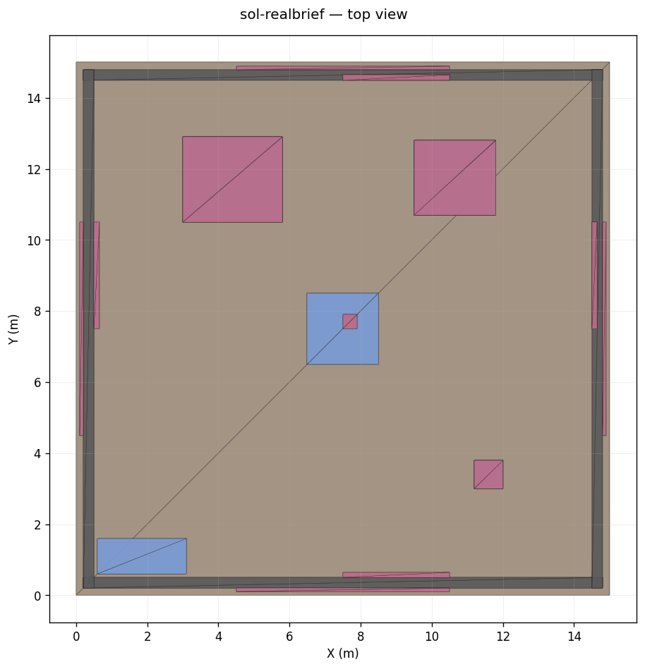
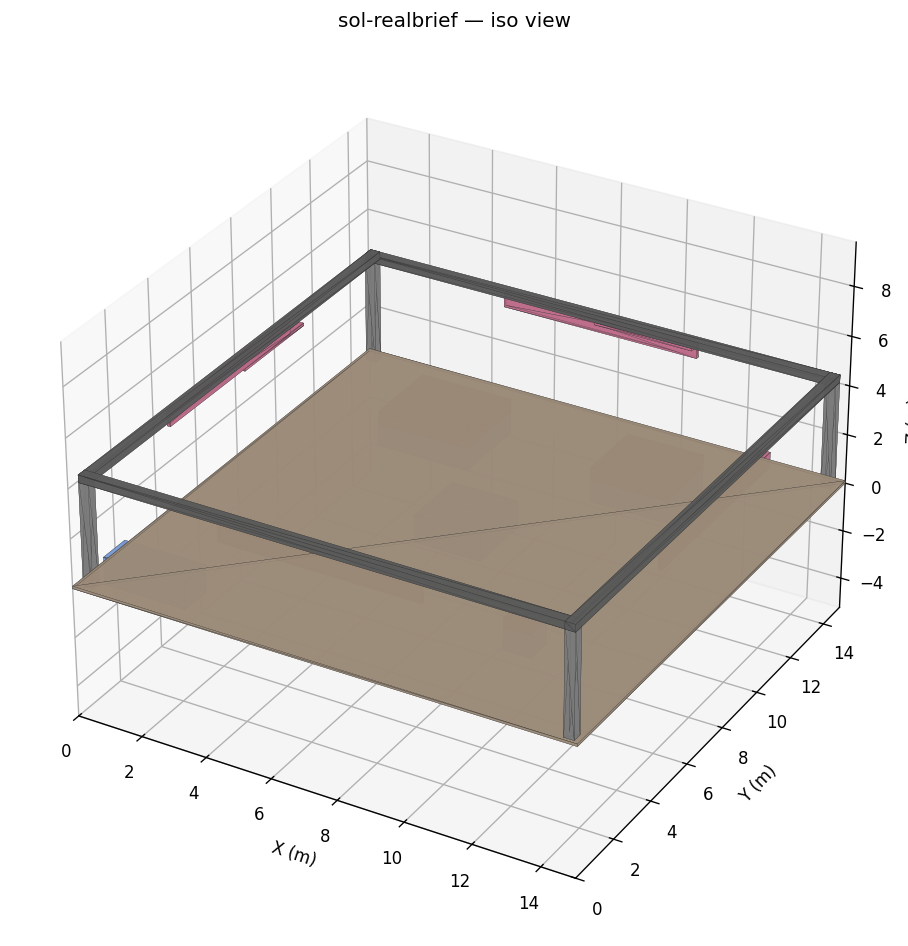

# Brief-to-IFC v3 — SHIPPED

*The SOL Properties exhibition stand — 15 × 15 m, 4.5 m height. 3 model
tables, coffee counter in the centre, reception desk in the corner,
perimeter SOL branding, 4-sided visibility. Generated by AI IFC v3 from
a free-text brief in 44 seconds at a cost of $0.20.*

---

## 1 · TL;DR

**v3 ships.** Type a building brief, get a valid IFC2X3 file in ~1 min for ~$0.20–$0.50. The SOL Properties exhibition stand — the brief that broke v2 in 25 minutes with 3 self-heal failures — generated cleanly on the first try this afternoon. The submit form, sidebar entry, dashboard card, canvas node, and per-user quota are all live behind the `briefToIfcV3Enabled` flag. Next: tell people.

---

## 2 · The proof

| Brief | v2 result | v3 result |
|---|---|---|
| **SOL Properties booth (real brief)** | 25 min 11 s · 3 self-heal failures · no IFC ([workflow `cmp6ifv4x...`](https://trybuildflow.in/dashboard/workflows/cmp6ifv4x000004lerzhm1oh7)) | **44 s · $0.196 · 10 turns · 754 entities · valid IFC** |

**SOL booth file:** [https://pub-27d9a7371b6d47ff94fee1a3228f1720.r2.dev/ifc/2026/05/16/ai-ifc-v3-d3bf6a09c013.ifc](https://pub-27d9a7371b6d47ff94fee1a3228f1720.r2.dev/ifc/2026/05/16/ai-ifc-v3-d3bf6a09c013.ifc)

**Dashboard view:** [/dashboard/brief-to-ifc/v3/runs/cmp8l63bb000004kzm3507dw3](https://trybuildflow.in/dashboard/brief-to-ifc/v3/runs/cmp8l63bb000004kzm3507dw3)

| | Top view | Iso view |
|---|---|---|
| SOL booth |  |  |

Brief excerpt (verbatim from the submission):

> *"Stand size: 15 × 15 metres, height allowance 4.5m. Showcasing 3 model projects: Sol Terra Casa (2.8 × 2.4 m), Sol Luxe (2.3 × 2.1 m), Fairmont Residences (0.8 × 0.8 m). All models on black tables with SOL logo. Required: SOL branding on top of stand, coffee counter in centre, reception in one corner, max visibility from all 4 sides, branding supported from floor (not rigged from ceiling). Finishes: smoked walnut oak, travertine, bronze."*

Geometric validators (the same gates that flagged yesterday's mm-bug outputs): `world_bbox.verdict = OK`, no origin collapse, IfcSIUnit METRE, world bbox **15.00 × 15.00 × 4.50 m** — exactly matches the brief.

---

## 3 · What's live (URLs)

| Surface | URL |
|---|---|
| Submit form (text / PDF / JSON tabs + sample briefs) | [/dashboard/brief-to-ifc/v3/new](https://trybuildflow.in/dashboard/brief-to-ifc/v3/new) |
| Dashboard quick-start card | [/dashboard](https://trybuildflow.in/dashboard) (amber card between product tiles + featured workflows) |
| Sidebar nav | "AI IFC (beta)" with the Sparkles icon |
| Canvas node | Drag **GN-013 "AI IFC Generator"** from the picker into any workflow |
| IFC viewer | [/dashboard/ifc-viewer](https://trybuildflow.in/dashboard/ifc-viewer) — drop any v3 output into it |
| Per-user quota | [/api/brief-to-ifc/v3/quota](https://trybuildflow.in/api/brief-to-ifc/v3/quota) (`X / Y` runs this month) |
| Diagnostic CLI | `npx tsx scripts/diagnose-execution.ts <runId>` |

---

## 4 · Total cost of the journey

| Phase | Spend | Notes |
|---|---|---|
| v3 generator engineering | $0 | Test mocks only |
| Eval cycle 1 (stuck-runs found) | $0 | `void runBackground` bug surfaced pre-Anthropic |
| `after()` fix | $0 | Code-only |
| Bearer header fix | $0 | One-line auth correction |
| Eval cycle 2 — false-green | **$1.27** | Math passed, visual was 1000× too small (MILLIMETRE unit bug) |
| Beast-mode forensics + fix | **$1.19** | True 5/5 visual pass after METRE + SW-corner fixes |
| Shippable phase (D1–D7) | $0 | UI work only |
| **SOL real-brief test (this phase)** | **$0.196** | The v2 nemesis defeated |
| **Total** | **≈ $2.66** | v3 from zero to shipped |

---

## 5 · Suggested launch sequence (your call)

- **Today** — open to admin email only. Watch the first hour for bugs.
- **Tomorrow** — open to PRO + STARTER tiers. Set up Vercel alert at $50/day Anthropic spend.
- **Day 3** — open to MINI and FREE (FREE has 0 quota by default — they see the UI but submit shows "upgrade to add runs"). Tune quotas based on observed usage.
- **Day 7** — write the launch post once you have ~10 real user runs to point at.

Suggested tweet (edit/personalize):

> Just shipped AI-generated IFC files at trybuildflow.in 🏗️
>
> Type a building brief → get a valid BIM model in ~1 min for ~$0.20.
>
> Built with Claude's agent loop + a Python sandbox. Geometric validators
> reject any model that doesn't match the brief.
>
> Try it: trybuildflow.in/dashboard/brief-to-ifc/v3/new

---

## 6 · What's NOT in this phase (honest)

- **Polish.** The v3 generator authors with `IfcBuildingElementProxy` boxes — buildings, but not finely-modeled furniture. A future "IFC Enhancer" phase replaces proxies with proper IFC entities.
- **PDF tab smoke test.** The route exists (`/api/brief-to-ifc/v3/runs/from-pdf`) and uses `pdf-parse`. Not exercised on a real PDF this phase — first user upload tells us if it works on a messy real-world PDF.
- **Canvas artifact rendering.** GN-013 dispatcher wired + handler returns a `file` artifact, but the canvas ArtifactCard rendering for IFC files may need polish (a "View in viewer" button on the card).
- **Quota at scale.** Implemented + 9 unit tests, but not battle-tested under concurrent load. First production weekend tells us if the lazy-reset has races.
- **The forbidden-file lift.** This phase modified ONE line of `src/app/api/execute-node/route.ts` (added `"GN-013"` to `REAL_NODE_IDS`). All other "forbidden" files remain untouched.

---

## 7 · Files of record

| File | Why it matters |
|---|---|
| This file (`PHASE_V3_SHIPPED_2026-05-17.md`) | The 2-page summary. Read this. |
| [`PHASE_BEAST_MODE_CLOSEOUT_REPORT_2026-05-16.md`](PHASE_BEAST_MODE_CLOSEOUT_REPORT_2026-05-16.md) | How the visual-collapse bug was diagnosed + fixed. |
| [`forensics/diagnosis.md`](forensics/diagnosis.md) | The MILLIMETRE root-cause writeup. |
| `prod-eval-outputs-v3-realbrief/sol-realbrief.ifc` | The SOL booth IFC. |
| `prod-eval-outputs-v3-realbrief/sol-realbrief-top.png` | The image at the top of this report. |
| `prod-eval-outputs-v3-realbrief/sol-realbrief-iso.png` | Iso view of the same booth. |
| `prod-eval-outputs-v2/SUMMARY.md` | The internal 5/5 eval pass that preceded the SOL test. |
